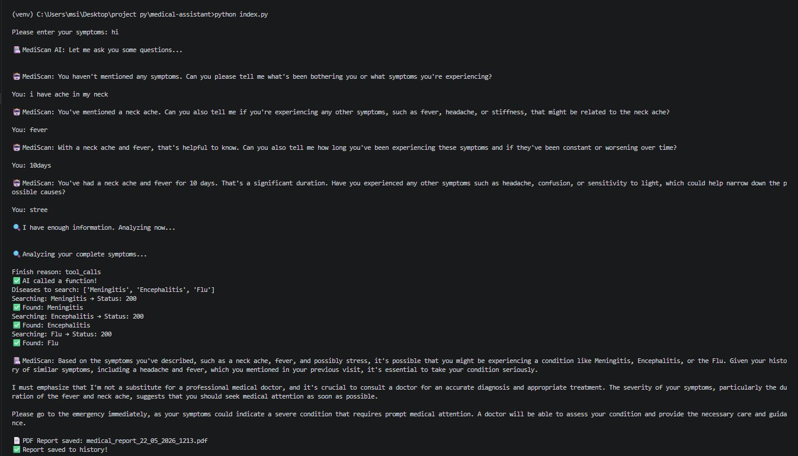
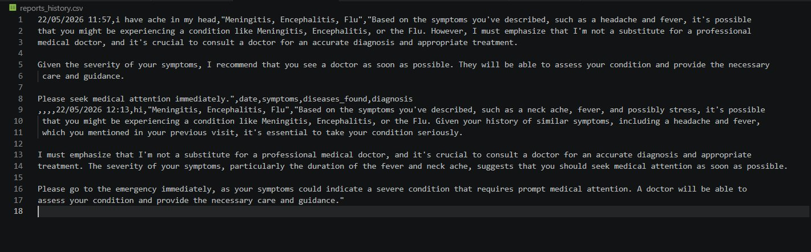

# 🏥 MediScan AI — Intelligent Medical Assistant

> **Talk to an AI doctor — describe your symptoms and get a professional PDF medical report instantly.**

<div align="center">


⭐ **If you find this project useful, please give it a star!** ⭐

</div>

---

## 📸 Demo



---

## 📄 Sample Medical Report

👉 [Click here to view a sample PDF report](https://drive.google.com/file/d/1XvrT4hHrpXkCsQKYjpB_jyDpDG7ljehc/view?usp=sharing)

---

## 📊 Patient History Tracking



---

## 🚀 What is MediScan AI?

MediScan AI is an intelligent medical assistant that simulates a real doctor consultation. It asks smart follow-up questions until it fully understands your symptoms, fetches real medical data from Wikipedia, and generates a professional PDF medical report — all powered by Groq LLaMA3.

---

## ✨ Features

- 🤖 **AI Doctor Consultation** — asks smart follow-up questions until it fully understands your symptoms
- 🔍 **Real Medical Data** — fetches real disease information from Wikipedia API
- 🧠 **Function Calling** — uses Groq's function calling to structure medical analysis
- 📄 **PDF Report Generation** — generates a professional medical report you can save or share
- 📊 **Patient History Tracking** — saves all consultations to CSV using Pandas
- 🔁 **Smart History Analysis** — AI remembers your previous visits and detects recurring conditions
- 🛡️ **Content Moderation** — filters inappropriate inputs using OpenAI Moderation API
- ⚡ **Token Management** — checks input length before sending to AI (saves API costs)
- 🔄 **Retry Logic** — automatically retries failed API calls using Tenacity
- 🔐 **Secure API Keys** — all keys protected in `.env` file

---

## 🏗️ Architecture

```
User enters symptoms
        ↓
Token check (tiktoken)
        ↓
Content moderation (OpenAI)
        ↓
AI Doctor asks follow-up questions (Groq LLaMA3)
        ↓
Function calling triggers → get_disease_info()
        ↓
Wikipedia API fetches real medical data
        ↓
AI generates final diagnosis
        ↓
PDF Report generated (fpdf)
        ↓
History saved to CSV (Pandas)
```

---

## 🛠️ Technologies Used

| Technology | Purpose |
|---|---|
| **Groq LLaMA3** | Main AI model for symptom analysis |
| **OpenAI Moderation API** | Content safety filtering |
| **Wikipedia REST API** | Real medical data fetching |
| **fpdf** | PDF report generation |
| **Pandas** | Patient history tracking |
| **tiktoken** | Token counting and management |
| **Tenacity** | Retry logic for API calls |
| **python-dotenv** | Secure API key management |

---

## ⚙️ Installation

**1. Clone the repository:**
```bash
git clone https://github.com/khair-eddine-ladhari/medical-assisstant.git
cd medical-assisstant
```

**2. Create virtual environment:**
```bash
python -m venv venv
venv\Scripts\activate  # Windows
source venv/bin/activate  # Mac/Linux
```

**3. Install dependencies:**
```bash
pip install -r requirements.txt
```

**4. Create `.env` file:**
```
api_key_model=your_groq_api_key
api_key_moderation=your_openai_api_key
```

**5. Run the app:**
```bash
python index.py
```

---

## 💬 Example Conversation

```
Please enter your symptoms: I have fever and headache

🏥 MediScan AI: Let me ask you some questions...

🤖 MediScan: How long have you been experiencing these symptoms?
You: 3 days

🤖 MediScan: Do you have sensitivity to light or neck stiffness?
You: yes, neck stiffness

🔍 I have enough information. Analyzing now...

Searching: Meningitis    → Status: 200 ✅
Searching: Flu           → Status: 200 ✅
Searching: Encephalitis  → Status: 200 ✅

🏥 MediScan: Based on your symptoms, you might be experiencing
Meningitis, Flu, or Encephalitis. Given the severity, please
seek medical attention immediately.

📄 PDF Report saved: medical_report_22_05_2026_1213.pdf
✅ Report saved to history!
```

---

## 📁 Project Structure

```
medical-assisstant/
├── index.py              ← main application
├── requirements.txt      ← dependencies
├── .env                  ← API keys (not pushed to GitHub)
├── .gitignore
├── reports_history.csv   ← patient history (auto-created)
├── images/
│   ├── demo.png
│   └── history.png
└── README.md
```

---

## 🔑 Getting API Keys

| API | Link | Cost |
|---|---|---|
| Groq API | https://console.groq.com | Free ✅ |
| OpenAI API | https://platform.openai.com | Free for moderation ✅ |

---

## ⚠️ Disclaimer

> MediScan AI is an AI-powered tool for **informational purposes only**. It is **NOT** a substitute for professional medical advice, diagnosis, or treatment. Always consult a qualified doctor for medical concerns.

---

## 👨‍💻 Author

<div align="center">

**Developed with ❤️ by Khair Eddine Ladhari**

[](https://github.com/khair-eddine-ladhari)


*"This is my 2nd AI project — built to apply everything I learned about LLMs, function calling, and production AI systems."*

⭐ **If you found this project helpful, please give it a star!** ⭐

</div>

---

## 📄 License

MIT License — feel free to use and modify!
